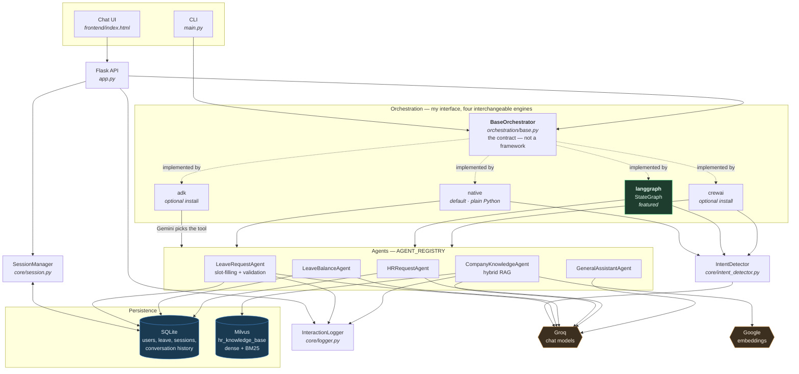
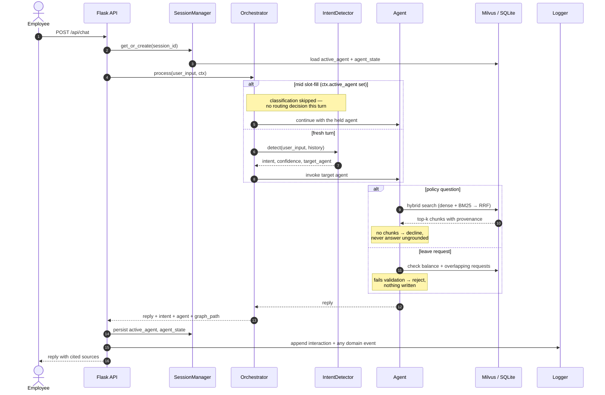
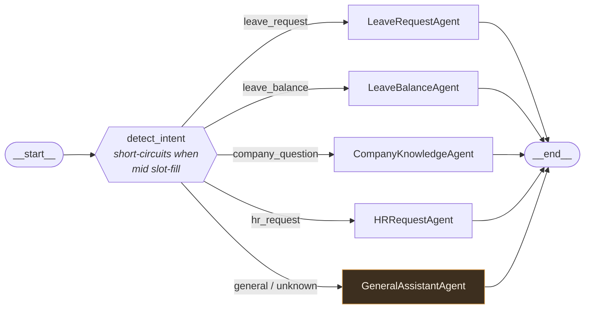
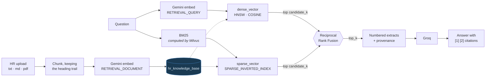
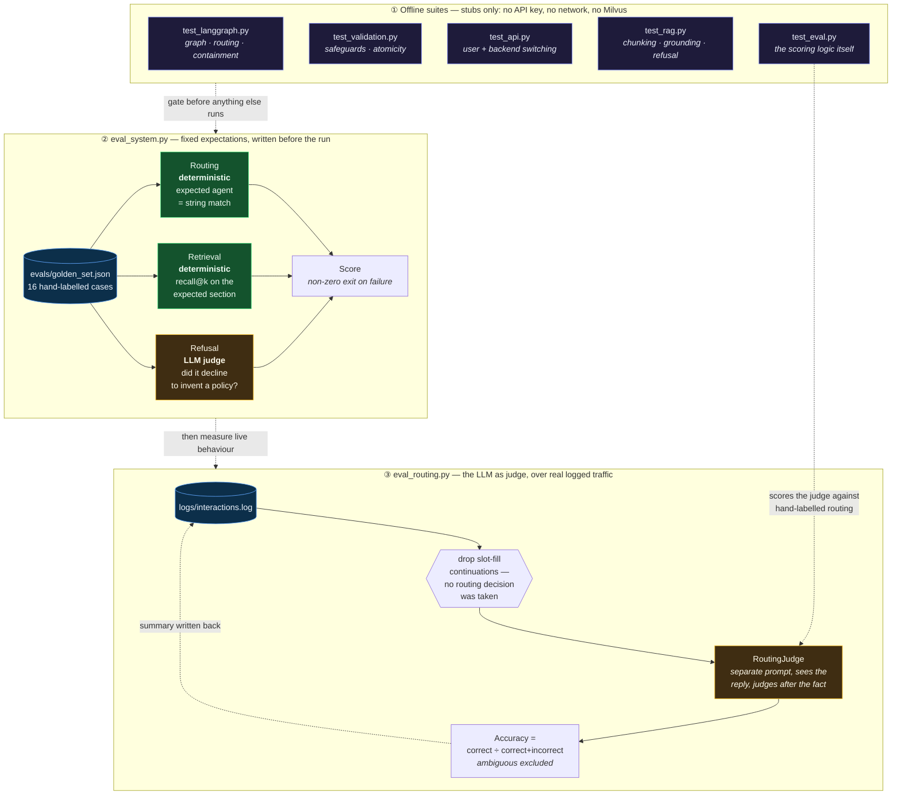
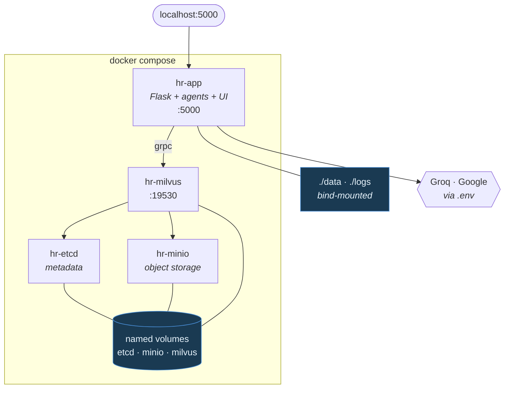

# 🏢 ACME HR — Multi-Agent Orchestration

A production-shaped HR assistant: five specialist agents, an intent router, hybrid
retrieval over Milvus, and an orchestration layer that can be swapped between four
execution engines by changing one line of config.

Ask it a policy question and it answers from a vector store with citations you can
follow back to a section of a document. Ask for leave and it fills the request over
several turns, checks it against your balance and your existing bookings, and
refuses — with reasons, in the log — if it doesn't hold up.

`docker compose up` brings up the whole thing: app, Milvus, and its dependencies.

---

## The architecture in one idea

**Orchestration is a port; the frameworks are adapters.**

The agents, the session state, the database and the retrieval layer sit *outside*
the orchestration package and never import it. `BaseOrchestrator`
([orchestration/base.py](orchestration/base.py)) defines the contract between
them. Four backends implement it:

| Backend | Engine | Status |
|---|---|---|
| **`native`** | none — plain Python | **Default.** The reference implementation |
| **`langgraph`** | a compiled LangGraph `StateGraph` | **Featured.** The most thoroughly covered path |
| `crewai` | CrewAI `Agent`/`Task`/`Crew` | Real integration, optional install, no automated coverage |
| `adk` | Google ADK root agent with tool dispatch | Real integration, optional install, no automated coverage |

This is not a wrapper that keeps a framework at arm's length. It is a boundary
drawn so that the *domain* — what an HR assistant actually does — survives the
framework underneath it changing.

### What that means at runtime

With `orchestrator_backend: langgraph`, a real `StateGraph` is compiled at startup
and **LangGraph genuinely runs the turn**: it owns the topology, evaluates the
conditional edge, decides which node to traverse to, merges state between nodes and
streams the steps back. `BaseOrchestrator.process()` never executes on that path —
the adapter overrides it. There is exactly one orchestrator running, and it is
LangGraph's.

What LangGraph deliberately does *not* provide is the routing **policy**.
`add_conditional_edges` requires the caller to supply the branch function; the
library has no opinion about how you choose. That function
([`_route_to_agent`](orchestration/langgraph_adapter.py)) consults this project's
own `IntentDetector` — a single JSON-mode LLM call returning an intent, a
confidence and a rationale. Supplying it is the documented use of the API, not a
detour around it.

Three things stay outside every engine, on purpose:

- **The agents**, resolved through `AGENT_REGISTRY`. No backend knows what one does.
- **Session state**, in `SessionContext` and persisted to SQLite — *not* in a
  LangGraph checkpointer, precisely so all four backends share it.
- **The routing policy**, so a change to how intent is decided lands everywhere at once.

### Why you should believe any of that

Claims about decoupling are cheap, so each one here has something you can run:

| Claim | Check |
|---|---|
| A framework can be removed entirely | The **Docker image installs neither CrewAI nor ADK** and the system runs fully; selecting one returns a clean `502` |
| No framework leaks into the domain | `langgraph`, `crewai` and `google.adk` are imported in **exactly one directory** |
| Backends are behaviourally interchangeable | `test_langgraph.py::test_matches_native_routing` asserts native and LangGraph route **identically** |
| State really isn't framework-owned | Start a leave request under LangGraph, switch to Native mid-flow, confirm — it submits |
| Domain changes don't touch adapters | Replacing the policy agent with Milvus hybrid RAG reached all four backends with **zero adapter edits** |

### Where the abstraction strains

`BaseOrchestrator` encodes an opinion: classify once, then one agent answers the
turn. LangGraph and CrewAI fit it cleanly. **ADK does not** — Gemini performs its
own tool selection, so there is no routing step to implement; that adapter
overrides `process()`, bypasses the interface for slot-filling, and needs a
side-channel to reach the live session. It works, and it is honest evidence of the
limit: a framework with a genuinely different execution model would strain this
interface rather than slot into it.

---

## What it does

Five agents share one `SessionContext`:

| Agent | Behaviour |
|---|---|
| **Leave Request** | Multi-turn slot-filling; validates against balance and overlapping bookings; atomic submission |
| **Leave Balance** | Live read from SQLite |
| **Company Knowledge** | Hybrid RAG over Milvus — dense + BM25, fused — with citations, and a refusal when nothing is retrieved |
| **HR Request** | Creates a tracked ticket |
| **General Assistant** | Fallback for anything unrouted |

Groq runs the chat models; Google runs the embeddings; SQLite holds records,
conversation history and slot-filling state; Milvus holds the policy corpus that
HR can upload to from the web UI.

Everything the system does is written to a JSONL log — turns and domain events in
one stream — with a [recorded session](logs/sample-session.log) committed so the
behaviour is inspectable without running anything.

---

## Quick Start — Docker (recommended)

Brings up Milvus, its etcd and MinIO dependencies, and the app. On first start
the app waits for Milvus, ingests `data/company_policy.txt`, then serves.

```bash
git clone https://github.com/mallahim01/hr_management-multiagent_orchestration.git
cd hr_management-multiagent_orchestration

cp .env.example .env          # add GROQ_API_KEY and GOOGLE_API_KEY
docker compose up --build     # first build ~4 min

# → http://localhost:5000
```

| Command | What it does |
|---|---|
| `docker compose up --build` | full stack |
| `docker compose run --rm app test` | the offline suites, inside the container |
| `docker compose run --rm app eval` | golden-set evaluation |
| `docker compose run --rm app ingest handbook.md` | ingest a document |
| `docker compose logs -f app` | follow the app log |
| `docker compose down -v` | stop and delete the Milvus volumes |

The image installs the `native` and `langgraph` backends only — `crewai` and
`google-adk` add roughly 2 GB between them. Switching to one of those in the UI
returns a clear error rather than failing at startup. To include them:

```bash
INSTALL_ALL_BACKENDS=true docker compose up --build
```

Ports are configurable, so this can sit alongside another stack:

```bash
MILVUS_HOST_PORT=19531 MILVUS_METRICS_PORT=9092 APP_HOST_PORT=5001 docker compose up
```

> **Give Docker at least 6 GB.** Milvus standalone plus etcd and MinIO idles
> around 250 MB but peaks well above that while loading. On an 8 GB Docker
> allocation, running **two** Milvus standalone instances gets both OOM-killed
> (exit 137) — remapping the ports avoids the port clash but not the memory one.
> Stop any other Milvus before bringing this up.

`./data` and `./logs` are bind-mounted, so the SQLite database and the
interaction log survive a rebuild and can be read from the host.

---

## Quick Start — local Python

### 1. Clone and install dependencies

```bash
git clone https://github.com/mallahim01/hr_management-multiagent_orchestration.git
cd hr_management-multiagent_orchestration

python -m venv .venv
source .venv/bin/activate        # Windows: .venv\Scripts\activate
pip install -r requirements.txt

# Optional: the crewai and adk backends (~2 GB of extra dependencies)
pip install -r requirements-backends.txt
```

### 2. Set your API key

The default provider is **Groq** (OpenAI-compatible endpoint, generous free tier):

```bash
cp .env.example .env             # Windows: copy .env.example .env
# Edit .env and set: GROQ_API_KEY=gsk_...
```

To use OpenAI instead, set `OPENAI_API_KEY` in `.env` and `llm.provider: openai`
in `config.yaml`. See [Configuration](#configuration) for the full list.

Set `GOOGLE_API_KEY` too — it powers the embeddings for the knowledge base.

### 3. Start Milvus and load the policy document (optional)

The policy agent uses hybrid RAG over Milvus. Start a standalone instance:

```bash
# https://milvus.io/docs/install_standalone-docker.md
docker run -d --name milvus-standalone -p 19530:19530 -p 9091:9091 \
  milvusdb/milvus:v2.6.4 milvus run standalone

python ingest_knowledge.py          # loads data/company_policy.txt
```

**This step is optional.** Without Milvus the policy agent falls back to putting
`data/company_policy.txt` straight into the prompt, and says so in its reply. You
lose citations and uploaded documents, not the ability to run the project.

### 4. Run

| Mode | Command |
|------|---------|
| **Web UI** (recommended) | `python main.py --web` |
| Interactive CLI | `python main.py` |
| Auto-demo (5 prompts) | `python main.py --demo` |
| CLI data preview | `python main.py --preview-cli` |
| HTML report | `python main.py --preview-html` |

Open **http://127.0.0.1:5000** for the web UI.

### 5. Run the tests

```bash
python verify.py             # imports, DB seeding, agent registry
python test_langgraph.py     # LangGraph orchestrator      – offline, no API key
python test_validation.py    # leave safeguards + DB rules – offline, no API key
python test_api.py           # Flask routes, user + backend switching – offline
python test_rag.py           # chunking, grounding, citations – offline, no API key
python test_eval.py          # routing-eval scoring logic  – offline, no API key
python test_eval.py --live   # …plus a live judge probe against labelled data
python test_rag.py  --live   # …plus real Milvus + Gemini retrieval checks
python test_backends.py      # each installed backend against the live LLM

python eval_system.py        # golden-set evaluation (see Evaluation)
```

79 offline checks. Or inside the container: `docker compose run --rm app test`.

The four `test_*.py` suites run against stubs and a throwaway database, so they
are deterministic and need no key, no network and no Milvus. `test_backends.py`
and the `--live` passes consume tokens.

### 6. Evaluate the routing

```bash
python eval_routing.py --limit 20
```

Replays recent turns from the interaction log and asks the model, after the fact,
whether each one reached the right agent. See [Evaluation](#evaluation).

---

## Architecture

### Components



### One turn, end to end



### The LangGraph backend

`orchestrator_backend: langgraph` compiles this graph once at construction and
streams every turn through it, so the path each turn took is reported rather than
inferred:



An unrecognised agent name routes to `GeneralAssistantAgent` instead of raising,
and an exception inside any node is contained rather than aborting the graph.

### Retrieval path



### How the system is evaluated

Two harnesses answer different questions. Deterministic scoring is used wherever
a fixed expectation is possible; the LLM judge is confined to the one place a
string match cannot work.



Green is deterministic, amber is model-judged. The judge is deliberately the
smallest part of the picture — and `test_eval.py --live` scores the judge itself
against hand-labelled routing, so an evaluator that quietly rubber-stamps
everything fails its own test.

### Container topology



### Switching Orchestration Backend

Set the startup default in `config.yaml`:

```yaml
orchestrator_backend: native     # or: crewai | langgraph | adk
```

Or switch live from the web UI's sidebar (`POST /api/backend`). Session state
lives in SQLite rather than inside any backend, so a conversation survives the
swap — you can begin a leave request under LangGraph and finish it under Native.

### Switching employee

Three employees are seeded, each with their own leave balance and history. The
sidebar switches between them (`POST /api/user`), so you can watch the same
question return different answers depending on who is asking.

This is a **demo persona switch, not authentication** — there is no login and no
authorisation anywhere in this project. Switching starts a new conversation on
purpose: slot-filling state is keyed by session rather than by employee, so
continuing a half-filled leave request after a switch would file it against the
wrong person.

### LangGraph specifics

The LangGraph backend reports the ordered nodes each turn traversed, both in the
chat UI under every reply and in the **Graph** tab alongside an ASCII rendering of
the compiled graph:

```
detect_intent → LeaveRequestAgent
```

An exception inside an agent node is contained rather than aborting the graph:
the user gets a plain apology, the session is released so a failing agent cannot
trap the conversation, and an `agent_node_failed` event is logged.

---

## Project Structure

```
.
├── agents/               # 5 specialised sub-agents
├── core/                 # LLM wrapper, intent detector, session, logger, routing judge
├── knowledge/            # chunking, Gemini embeddings, Milvus hybrid store
├── evals/                # golden_set.json — hand-labelled evaluation cases
├── logs/                 # JSONL interaction log + a committed sample session
├── docker/               # container entrypoint
├── docs/                 # Architecture deep-dive
├── orchestration/        # 4 backends + abstract base + factory
├── database/             # SQLite schema + CRUD helpers
├── preview/              # CLI viewer + HTML report generator
├── frontend/             # Chat UI (HTML/CSS/JS)
├── data/                 # SQLite DB, company policy, logs, reports
├── config.yaml           # Backend, model, user, DB settings
├── .env                  # API key (not committed)
├── app.py                # Flask web server
└── main.py               # CLI entry point
```

See [docs/architecture.md](docs/architecture.md) for how agents, orchestrators,
and session state fit together, and
[docs/submission-notes.md](docs/submission-notes.md) for a file-by-file map of
the load-bearing code, what is and isn't mine, and the failure modes this system
was designed against.

---

## Demo Conversation Flow

| User says | Intent | Agent |
|-----------|--------|-------|
| "What is our WFH policy?" | `company_question` | CompanyKnowledgeAgent (hybrid RAG + citations) |
| "I'm sick, need leave" | `leave_request` | LeaveRequestAgent (slot-fill) |
| "How many leaves do I have?" | `leave_balance` | LeaveBalanceAgent |
| "I need help with reimbursement" | `hr_request` | HRRequestAgent |
| "Hello!" | `general` | GeneralAssistantAgent |

---

## Configuration

```yaml
# config.yaml
orchestrator_backend: native   # native | crewai | langgraph | adk
active_user_id: 3              # Auto-created on first run
llm:
  provider: groq               # groq | openai
  model: llama-3.3-70b-versatile
  max_retries: 3
  temperature: 0.7
database:
  path: data/hr_demo.db
conversation:
  history_size: 3              # Recent exchanges sent as context
```

`llm.provider` selects both the API endpoint and which `.env` keys are read
(see `PROVIDERS` in [core/llm_wrapper.py](core/llm_wrapper.py)). For Groq you may
set `GROQ_API_KEY_2` / `GROQ_API_KEY_3` as spares — the wrapper rotates to the
next key when one hits its free-tier rate limit.

---

## Database Tables

| Table | Purpose |
|-------|---------|
| `users` | Employee records |
| `leave_balance` | Annual leave quota |
| `leave_requests` | Submitted leave applications |
| `hr_requests` | Generic HR tickets |
| `conversation_history` | Full message log with intent/agent |
| `sessions` | Active slot-filling state per session |

Three dummy users are seeded automatically on first run.

### Leave-request safeguards

A leave request is refused, with a message naming the specific problem, when it:

- exceeds the user's remaining balance,
- overlaps a `Pending` or `Approved` request already on the calendar,
- carries dates that are unparseable or run backwards.

Validation runs twice — before the confirmation prompt and again on submission,
since the balance can move in between. Each rejection writes a structured line to
`data/interactions.log` (`"event": "leave_request_rejected"`) carrying the reason
code and the numbers, alongside the friendly reply the user sees. Storing the
request and deducting the balance share a single transaction, so a failure cannot
leave a request with no matching deduction. See `python test_validation.py`.

---

## API Endpoints (Flask)

| Method | Path | Description |
|--------|------|-------------|
| GET | `/` | Chat UI |
| POST | `/api/chat` | Send a message |
| GET | `/api/status` | System info |
| GET | `/api/users` | Seeded employees with leave balances |
| POST | `/api/user` | Switch the acting employee |
| POST | `/api/backend` | Switch orchestration backend at runtime |
| GET | `/api/graph` | Compiled StateGraph + last node path (LangGraph only) |
| GET | `/api/eval` | LLM-as-judge scoring of recent routing |
| GET | `/api/knowledge/status` | Milvus/embedding availability, document counts |
| GET | `/api/knowledge/documents` | Documents in the knowledge base |
| POST | `/api/knowledge/ingest` | Upload a document (file or pasted text) |
| DELETE | `/api/knowledge/documents/<id>` | Remove a document |
| GET | `/api/knowledge/search` | Preview hybrid retrieval for a query |
| GET | `/api/history` | Conversation log |
| GET | `/api/preview/leave-balance` | Balance JSON |
| GET | `/api/preview/leave-requests` | Leave requests JSON |
| GET | `/api/preview/hr-requests` | HR requests JSON |
| GET | `/api/report` | Generate HTML report |

---

## Backend Status

Each backend's implementation and coverage in detail. See
[The architecture in one idea](#the-architecture-in-one-idea) for how they relate.

| Backend | Implementation | Tested |
|---|---|---|
| `native` | Reference implementation — plain Python intent routing | Yes |
| `langgraph` | Real compiled `StateGraph`; nodes call the same agents as native, with node-level error containment and per-turn path reporting | Yes — `python test_langgraph.py` (10 offline checks, no API key needed) |
| `crewai` | Real `Agent`/`Task`/`Crew`; the native agent runs first, then a sequential Crew polishes the reply | Manually, against live Groq. No automated coverage |
| `adk` | Real `google.adk` root agent with the five agents exposed as tools; Gemini decides routing | Manually, against live Gemini. No automated coverage |

**`crewai` requires the `litellm` extra** (in `requirements-backends.txt`). Passing a
model *string* to a CrewAI agent makes it attach a `cache_breakpoint` field that
Groq rejects, so the adapter builds an explicit `crewai.LLM` object instead.

**`adk` requires `GOOGLE_API_KEY`** and a current Gemini model. Google retires model
ids on a rolling basis; the default is the `gemini-flash-latest` alias, overridable
with `ADK_MODEL`. A retired id returns 404 and sends every turn down the native
fallback path — which is now reported in the result's `reasoning` and logged as an
`adk_fallback` event, rather than passing silently for success.

All four share the same `BaseOrchestrator` contract and the same agents — only the
routing machinery differs. See [docs/architecture.md](docs/architecture.md).

---

## Knowledge base — hybrid RAG

`CompanyKnowledgeAgent` answers policy questions from a Milvus collection rather
than from a prompt containing the whole policy file. Each chunk is indexed twice
in the same collection:

| Arm | How | Good at |
|---|---|---|
| **Dense** | Gemini `gemini-embedding-001`, HNSW + COSINE | meaning — *"can I do my job from my house?"* finds the WFH clause despite sharing no words with it |
| **Sparse** | Milvus's built-in BM25 function over the same text | exact terms — *"LWP"*, a form number, a policy code, which dense vectors handle poorly |

Both arms retrieve `candidate_k` results and the two **rankings** are fused with
Reciprocal Rank Fusion. Fusing rankings rather than scores matters here: BM25 is
unbounded and cosine sits in [-1, 1], so a weighted sum of raw scores would need
per-corpus tuning to mean anything.

Retrieval quality is mostly decided by chunking, so headings are detected and
carried onto every chunk — both as metadata and prefixed onto the embedded text.
A chunk reading *"5 days for immediate family"* is far less findable than
`SECTION 1 – LEAVE POLICY › 1.5 Bereavement Leave: 5 days for immediate family`.

### Schema

`pk`, `text`, `sparse_vector` (BM25 output), `dense_vector`, plus the metadata
that makes an answer auditable: `doc_id`, `source`, `title`, `section`,
`chunk_index`, `total_chunks`, `uploaded_at`, `uploaded_by`. Every answer cites
the extracts it used, and every citation resolves back to a document and chunk.

### HR document upload

The **Knowledge** tab lets HR drop in a `.txt`, `.md`, `.csv`, `.json` or `.pdf`
file (or paste text), see what is stored, preview exactly what a query retrieves,
and remove a document. Re-uploading the same filename **replaces** the previous
copy rather than adding a second one — otherwise a corrected policy would sit in
the index next to the version it was meant to supersede, and the agent would
happily cite either.

From the CLI:

```bash
python ingest_knowledge.py                       # seed the bundled policy
python ingest_knowledge.py handbook.md           # add a document
python ingest_knowledge.py --search "LWP"        # preview hybrid retrieval
python ingest_knowledge.py --list                # what is stored
python ingest_knowledge.py --delete doc-abc123   # remove a document
```

### Grounding rules

- Retrieved extracts are numbered and the model is told to cite them inline.
- **If nothing is retrieved the agent does not call the LLM at all** — it returns
  the "no information" response and logs `knowledge_no_results`. Answering with an
  empty context is how a RAG system starts inventing policy.
- If Milvus or the embedding key is unavailable, the agent falls back to the
  bundled policy file and **says so in the reply**. The failure is logged as
  `knowledge_retrieval_failed`; it is never a silent downgrade.

All four backends resolve this agent through `AGENT_REGISTRY`, so native,
LangGraph, CrewAI and ADK all use RAG without knowing Milvus exists.

---

## Evaluation

Two evaluations, answering different questions.

| | `eval_system.py` | `eval_routing.py` |
|---|---|---|
| **Question** | "does the system still do what we decided it should?" | "was the routing on real traffic correct?" |
| **Input** | `evals/golden_set.json` — 16 hand-labelled cases | whatever is in the interaction log |
| **Scoring** | deterministic for routing and retrieval; LLM judge only for refusal | LLM as judge throughout |
| **Ground truth** | yes, written before the run | none — open-ended traffic |
| **Use** | regression gate; exits non-zero on any failure | spot-checking production behaviour |

### `eval_system.py` — golden set

`evals/golden_set.json` holds expected answers written by hand, so a pass means
the system matched a fixed expectation rather than an expectation written to fit
the system. Three suites:

**1. Routing (deterministic, no judge).** The expected agent is a string; the run
matches it or it does not. Includes deliberately adjacent pairs — *"What is the
reimbursement policy?"* (policy → knowledge agent) against *"I need to claim my
travel expenses"* (action → HR agent) — because that boundary is where an
intent classifier actually fails.

**2. Retrieval (deterministic).** Checks the expected policy section appears in
the retrieved chunks and that expected facts appear in the answer. Also reports
recall@1 for each arm alone against the fused result.

**3. Refusal (LLM as judge).** *Did it decline to invent a policy?* cannot be a
string match, so this suite uses a judge — but a narrow one, asked a single
yes/no question with a fixed rubric, not "is this answer good".

```bash
python eval_system.py                 # all three suites
python eval_system.py --suite rag     # routing | rag | refusal | all
docker compose run --rm app eval
```

Last run: **16/16**, routing 8/8, retrieval 6/6, refusal 2/2.

### What the retrieval numbers actually show

The per-arm comparison is reported because it is the honest test of the hybrid
claim, and on this corpus it does not support it:

```
recall@1 over 5 pinned cases:  dense-only 5/5 | sparse-only 5/5 | hybrid 5/5
```

**On a 29-chunk policy document, fusion buys nothing measurable.** Either arm
alone already ranks the right chunk first. Part of the reason is a choice made
earlier: chunks are prefixed with their heading trail before embedding, which
puts literal strings like `LWP` into the dense vector and removes exactly the
weakness BM25 was there to cover.

Hybrid retrieval is kept anyway, for reasons that are about where this goes
rather than where it is: BM25 degrades far more gracefully as a corpus grows and
as queries contain identifiers the embedding model never saw, and the fusion
plumbing is the part that is annoying to retrofit later. But this is currently
an architectural bet, not a measured win, and the eval prints the number that
says so on every run.

The other honest gap: **6 retrieval cases is not a benchmark.** There is no
labelled recall@k set over a realistic corpus, so "retrieval works" here means
"works on the cases I thought to write down".

### `eval_routing.py` — LLM as judge over real traffic

`python eval_routing.py` (or the **Evals** tab, or `GET /api/eval`)
replays recent turns out of the interaction log and asks the model, after the fact
and with the agent's actual reply in view, whether each turn reached the right
agent.

```
  [PASS] turn 1  (langgraph, conf 95%)
         user:     What is our work from home policy?
         routed:   CompanyKnowledgeAgent  (intent: company_question)
         judge:    The question is about a company policy.

  [FAIL] turn 2  (native, conf 90%)
         user:     How many annual leave days do I have left?
         routed:   CompanyKnowledgeAgent
         expected: LeaveBalanceAgent
         judge:    Asks for a personal balance, not a policy.

  routing accuracy: 87.5%
```

Three things make the number mean something:

- **The judge does not reuse the detector's prompt.** Grading the classifier with
  its own prompt would mostly measure it against itself, so the judge gets its own
  instructions, sees the reply as evidence, and judges after the fact.
- **Slot-fill continuations are excluded, not scored.** While an agent holds the
  session the orchestrator skips classification deliberately; there is no routing
  decision on those turns, and counting them would inflate accuracy.
- **Ambiguous and errored turns are excluded from the denominator** rather than
  counted as passes. `accuracy = correct / (correct + incorrect)`.

An evaluator that answers "correct" to everything would report 100% forever, so
`python test_eval.py --live` feeds the real judge eight synthetic turns with
hand-labelled good and bad routing and checks it separates them. Re-run it
whenever the judge prompt or the model changes.

`eval_routing.py` exits non-zero when it finds a misroute, so it can gate a
pipeline. Each run also writes a `routing_eval` summary back to the log.

---

## Design decisions & known limitations

### Why intent-based routing

A single large prompt with every capability described in it would have been less
code. Routing through a dedicated classifier was chosen because:

- **The decision is inspectable.** `IntentDetector` returns an intent, a
  confidence, and a one-sentence rationale, all of which are logged. When the
  assistant answers oddly you can see whether it was misrouted or the agent
  itself was wrong — with one big prompt those two failures look identical.
- **Each agent gets a small prompt.** `CompanyKnowledgeAgent` sees only the
  handful of policy extracts retrieved for the question; `LeaveBalanceAgent` sees
  only the balance row. Smaller prompts mean fewer tokens and less room to
  hallucinate across domains.
- **Routing is what decides whether RAG runs at all.** Retrieval only fires on
  `company_question`, so leave arithmetic and ticket creation never pay for an
  embedding call, and a policy answer is never grounded in a leave balance.
- **Routing is cheap and swappable.** Classification is one short JSON-mode call.
  It could be replaced with keyword rules or a fine-tuned classifier without
  touching a single agent.

The cost is a second LLM round-trip per turn. That is mitigated by skipping
classification entirely while an agent holds the conversation for slot-filling.

### Why pluggable backends

The orchestration framework landscape moves quickly, and the interesting question
is usually "what does this framework actually buy me?" — which is impossible to
answer if the business logic is welded to one of them.

Drawing the boundary at `BaseOrchestrator` makes the comparison concrete rather
than rhetorical. Native and LangGraph are asserted by test to produce identical
routing, so any difference between them is framework overhead rather than
behaviour — and the same swap that proves the point also made adding hybrid RAG a
change to one agent instead of four adapters.

The cost is a layer that earns nothing on a single-framework project, and an
interface whose shape is an opinion — see
[Where the abstraction strains](#where-the-abstraction-strains) for the case
(ADK) where that opinion is wrong.

### What is and isn't verified

| Area | Status |
|---|---|
| `native`, `langgraph` routing and state | Automated, offline, deterministic (`test_langgraph.py`) |
| Leave safeguards, DB validation, atomicity | Automated, offline (`test_validation.py`) |
| Routing quality | Scored by an LLM judge (`eval_routing.py`); the judge itself is checked against labelled data by `test_eval.py --live` |
| RAG grounding and degradation | Automated, offline (`test_rag.py`) — citations, refusal on empty retrieval, fallback when Milvus is down |
| Hybrid retrieval against real Milvus | `test_rag.py --live` checks exact-term and paraphrase recall; **no labelled recall@k benchmark** |
| `crewai` backend | Run manually against live Groq; no automated coverage |
| `adk` backend | Run manually against live Gemini; no automated coverage |
| Agent answer quality | **Not evaluated.** The judge scores *which agent* handled a turn, not whether the answer was correct or well-grounded |

### Known limitations

- **No authentication.** The employee can be switched from the sidebar, but that
  is a persona picker, not a login: there is no password, no session identity and
  no authorisation. Anyone who can reach the API can act as any employee and read
  their leave history.
- **Approval is cosmetic.** Requests are stored as `Pending` and nobody can
  approve them; there is no HR-side view. The balance is deducted at submission
  rather than on approval, which is the wrong policy for a real system but keeps
  the demo's numbers legible.
- **Retrieval quality is unmeasured.** Hybrid search demonstrably finds the right
  clause on the queries tried, but there is no labelled retrieval set and so no
  recall@k or MRR figure. The routing evaluation does not cover it.
- **No reranker.** RRF fuses two rankings; a cross-encoder over the fused
  candidates would do better, at the cost of another model call per query.
- **Chunking is heading-driven and tuned to this document.** A policy file with
  no headings falls back to paragraph packing, which is workable but blunter.
- **Uploads are unauthenticated.** Anyone who can reach the app can add or delete
  policy documents that the assistant will then cite as authoritative. In a real
  deployment this endpoint needs to sit behind an HR role.
- **Scanned PDFs are not handled** — text extraction only, no OCR.
- **The container stack has no resource limits.** Compose declares no `mem_limit`,
  so Milvus can be OOM-killed under memory pressure rather than degrading. This
  is observable: on an 8 GB Docker allocation, two Milvus standalone instances
  kill each other with exit 137.
- **No log rotation and no redaction.** See [logs/README.md](logs/README.md).
- **No concurrency story.** SQLite in WAL mode tolerates concurrent reads, and the
  balance deduction is guarded against going negative, but there is no locking
  around the read-validate-write sequence across separate HTTP requests.
  The `adk` backend is additionally not concurrency-safe: ADK invokes its tool
  functions through its own runner, so the caller's `SessionContext` is parked in
  a single instance slot for the duration of a turn and simultaneous requests
  would read each other's.
- **Relative dates are resolved by the LLM.** "Next Tuesday" is turned into a date
  inside the extraction prompt. Malformed output is caught by validation, but a
  plausible-yet-wrong date is not.
- **Session state is unbounded.** `sessions` rows are never expired or cleaned up.
- **Git history carries two author identities**, one with a malformed email
  (`smallahimali.com`, missing the `@`). Left as-is rather than rewriting history.

### What I would harden next, in order

1. **Extend evaluation from routing to answers and retrieval.** `eval_routing.py`
   scores which agent handled a turn; nothing scores whether the answer was right
   or whether the right chunk was retrieved. The next step is a labelled
   question→chunk set for recall@k, plus a groundedness check that fails an answer
   making claims absent from its cited extracts.
2. **Put the upload endpoint behind an HR role.** Right now anyone who can reach
   the app can change what the assistant treats as company policy.
3. **Add a reranker** over the fused candidates.
2. **Automated coverage for `crewai` and `adk`**, using the same stub-LLM
   technique. Both are currently only verified by hand, which is how the ADK
   tool functions ran for a while against a hardcoded `user_id=1` — reporting
   one employee's leave balance to another — without anything catching it.
3. **Move approval into the model**: deduct on approval rather than submission,
   add a status transition path, and give HR a view.
4. **Real retrieval** for the policy document — chunk, embed, and retrieve, with
   citations back to the source section.
5. **Authentication**, so `user_id` comes from a session rather than a config file.
